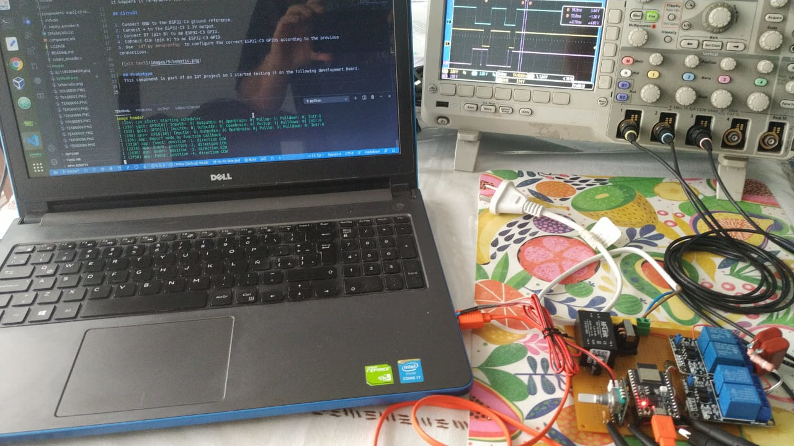
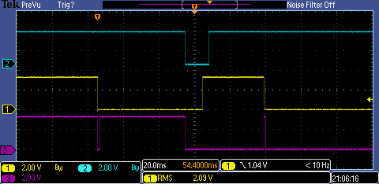

# ESP32-C3 Rotary Encoder Example

This is an example of using the [esp32-c3-rotary-encoder](https://github.com/) driver to track the relative position of an [incremental](https://tech.alpsalpine.com/prod/e/html/encoder/incremental/ec11/ec11_list.html) rotary encoder.

The need to develop this component arises from using an incremental encoder in an IOT project with an ESP32-C3 processor that lacks the [PCNT](https://github.com/espressif/esp-idf/tree/73db142/examples/peripherals/pcnt/rotary_encoder) module that supports the rotary encoder component by espressif.

On GitHub there are many components developed for esp32, some very good like [David Antliff](https://github.com/DavidAntliff/esp32-rotary-encoder-example). While it works, it makes extensive use of IRQs to decode the grays code. Therefore, to reduce false trips due to contact bounces and lack of Schmitt trigger, I used the strategy of defining one of the pins as clock (A) and the other as data (B), and only activate the irq of the clock. But when it happens, it is deactivated, a timer is triggered so that when it expires it defines the state, and the data irq is activated, so that when it happens it re-enables the clock irq.

## Circuit

1. Connect GND to the ESP32-C3 ground reference.
2. Connect + to the ESP32-C3 3.3V output.
3. Connect DT (pin B) to an ESP32-C3 GPIO.
4. Connect CLK (pin A) to an ESP32-C3 GPIO.
5. Use `idf.py menuconfig` to configure the correct ESP32-C3 GPIOs according to the previous connections.

While not necessary to stabilize the encoder behavior due to mechanical contact false tripping, two 10 nF capacitors were added to improve EMI performance.

## Prototype 
This component is part of an IOT project so I started testing it on the following development board.

## Behavior analysis
To viewing events of IRQs a test PIN is connected to an oscilloscope channel.
The following images show oscillograms with typical events when the encoder is operated. In all channels 1 (yellow) is connected to the clock pin, channel 2 (light blue) is connected to the data pin, and channel 3 (purple) is connected to the test pin.

In the configuration menu there are two options that allow you to enable debugging of irqs events and choose the GPIO, please use `idf.py menuconfig`.

The following image shows the one-step rotation without bouncing of the mechanical contacts.
When the clock goes down, it can be seen how the test channel changes state indicating that the firmware is running the irq that triggers the timer and disables the clock irq, and 1 mS later we see that the control channel changes state indicating that the routine validated the encoder status, and since the data irq had been activated previously, we see that the test pin changes state again, indicating that the cycle is starting again (clock irq activated and data irq deactivated).

