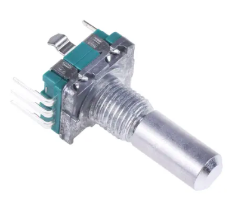
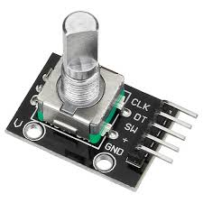
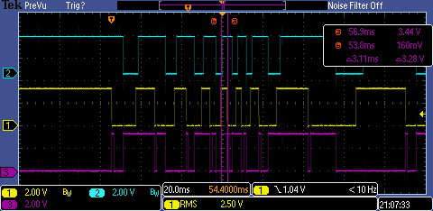

# ESP32-C3 Rotary Encoder Example

This is an example of using the [esp32-c3-rotary-encoder](https://github.com/) driver to track the relative position of an [incremental](https://tech.alpsalpine.com/prod/e/html/encoder/incremental/ec11/ec11_list.html) rotary encoder.




The need to develop this component arises from using an incremental encoder in an IOT project with an ESP32-C3 processor that lacks the [PCNT](https://github.com/espressif/esp-idf/tree/73db142/examples/peripherals/pcnt/rotary_encoder) module that supports the rotary encoder component by espressif.

On GitHub there are many components developed for esp32, some very good like [David Antliff](https://github.com/DavidAntliff/esp32-rotary-encoder-example). While it works, it makes extensive use of IRQs to decode the grays code. Therefore, to reduce false trips due to contact bounces and lack of Schmitt trigger, I used the strategy of defining one of the pins as clock (A) and the other as data (B), and only activate the irq of the clock. But when it happens, it is deactivated, a timer is triggered so that when it expires it defines the state, and the data irq is activated, so that when it happens it re-enables the clock irq.

## Circuit

1. Connect GND to the ESP32-C3 ground reference.
2. Connect + to the ESP32-C3 3.3V output.
3. Connect DT (pin B) to an ESP32-C3 GPIO.
4. Connect CLK (pin A) to an ESP32-C3 GPIO.
5. Use `idf.py menuconfig` to configure the correct ESP32-C3 GPIOs according to the previous connections.

While not necessary to stabilize the encoder behavior due to mechanical contact false tripping, two 10 nF capacitors were added to improve EMI performance.


## Prototype 
This component is part of an IOT project so I started testing it on the following development board.


## Behavior analysis
To view IRQ events, a test PIN is connected to an oscilloscope channel.
The following images show oscillograms with typical events when the encoder is operated, for all images: channels 1 (yellow) are connected to the clock pin, channel 2 (light blue) is connected to the data pin, and channel 3 ( violet) is connected to the test pin.

In the configuration menu there are two options that allow you to enable debugging of irqs events and choose the GPIO for the test pin, please use `idf.py menuconfig`.

The following image shows the one-step rotation without bouncing of the mechanical contacts.
When the clock goes down, the test channel toggle indicating that the firmware is running the isr that triggers the timer and disables the clock irq, and 1 mS later we see that the control channel toggle again indicating that the routine validated the encoder status, and since the data irq had been activated previously, a last toggle indicate that the cycle is starting again (clock irq activated and data irq deactivated).


The following image shows the fast rotation of several steps, the smallest pulse lasts approximately 3 mS.



The following image shows the false trips by the mechanical contact, it can be seen that there is no retrigger of the 1mS timer because the routine manages to read the clock pin low.


The following image shows the false trips by mechanical contact, you can see that there is a 1mS timer re-trigger because the routine does not read the clock pin low.


## Brief description of the API
To use the component, you have to initialize it with the `rotenc_init` function, which takes as parameters the pins where the clock (A) and data (B) are connected plus the time for the anti-bounce, if successful it returns ESP_OK.

The driver can notify the event in three different ways, by Polling, by Freertos Queue, or through function callback. Queuing and polling have no requirements, but the callback function should be used very carefully so as not to perform blocking/delaying operations, as this could affect the performance of the esp_timer component.

Note: if you use the example application you can configure the pins and the notification mode with the `idf.py menuconfig`.

Para usar el callback hay que llamar la funcion `rotenc_set_event_callback` y para cola de mensajes `rotenc_set_event_queue` en conjunto con la funcion `rotenc_wait_event`. Ambas retorna un la estructura `rotenc_event_t` que contiene el campo de posicion y sentido de giro detectado. 

To use the callback you have to call the `rotenc_set_event_callback` function and for the message queue` rotenc_set_event_queue` together with the `rotenc_wait_event` function. Both return a `rotenc_event_t` structure that contains the position fields and the detected direction of rotation.

For mechanical encoders with pushbuttons, and although this functionality can be implemented very easily with espressif idf, a callback can be configured with the `rotenc_init_button` function.

Callback Example
----------------
```c
    
    static void rotenc_log_event(rotenc_event_t event)
    {
        ESP_LOGI(TAG, "Event: position %d, direction %s", event.state.position,
                  event.state.direction ? (event.state.direction == ROTENC_CW ? "CW" : "CCW") : "NOT_SET")  ;
    }

    void app_main()
    {
        /* Initialise the rotary encoder device with the GPIOs for Clock (A) and Data (B)  signals and debounce timeout*/
        rotenc_info_t info = { 0 };
        ESP_ERROR_CHECK(rotenc_init(&info, 
                                    CONFIG_ROT_ENC_CLK_GPIO, 
                                    CONFIG_ROT_ENC_DTA_GPIO, 
                                    CONFIG_ROT_ENC_DEBOUNCE));
        ESP_ERROR_CHECK(rotenc_set_event_callback(&info, rotenc_log_event));

        while (1) {
            vTaskDelay(1000 / portTICK_PERIOD_MS);
        }
    }

Push Button and Queue Example
-----------------------------
```c
    static void button_callback(void* arg)
    {
        rotenc_info_t * info = (rotenc_info_t*) arg;
        ESP_LOGI(TAG, "Reset rotary encoder");
        ESP_ERROR_CHECK(rotenc_reset(info));
    }

    static void rotenc_log_event(rotenc_event_t event)
    {
        ESP_LOGI(TAG, "Event: position %d, direction %s", event.state.position,
                  event.state.direction ? (event.state.direction == ROTENC_CW ? "CW" : "CCW") : "NOT_SET")  ;
    }

    void app_main()
    {
        /* Initialise the rotary encoder device with the GPIOs for Clock (A) and Data (B)  signals and debounce timeout*/
        rotenc_info_t info = { 0 };
        ESP_ERROR_CHECK(rotenc_init(&info, 
                                    CONFIG_ROT_ENC_CLK_GPIO, 
                                    CONFIG_ROT_ENC_DTA_GPIO, 
                                    CONFIG_ROT_ENC_DEBOUNCE));
        ESP_ERROR_CHECK(rotenc_set_event_queue(&info, 1000));
        ESP_ERROR_CHECK(rotenc_init_button(&info, 
                                       CONFIG_ROT_ENC_BUTTON_GPIO, 
                                       CONFIG_ROT_ENC_BUTTON_DEBOUNCE, 
                                       button_callback));

        while (1) {
            // Wait for incoming events on the event queue.
            rotenc_event_t event = { 0 };
            if (rotenc_wait_event(&info, &event) == ESP_OK) {
                rotenc_log_event(event);
            }
        }
    }